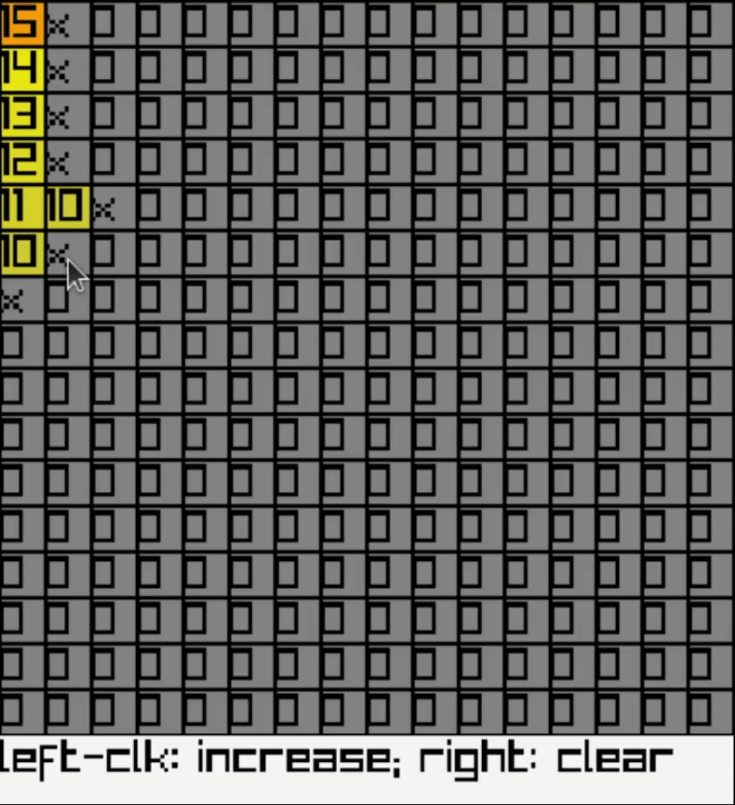

# Minecraft Lighting Simulation 0

Usage:

Install Go 1.17 or above.

Install `raylib` dependencies.

See their instructions [at their repository (GitHub)](https://github.com/gen2brain/raylib-go).

Then do `go get` and then `go build`.
